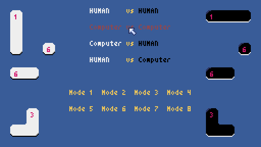

# オセロミノ

[テトリバ](https://note.com/harubin/n/nb1e18aae79ab)を参考にしました。
オセロとポリオミノで「オセロミノ」です。

## 操作方法

* マウスを使って操作します。
* 「Mode」を選んで、「Computer vs Human」又は「Human vs Computer」をクリックするとコンピュータと対戦できす。
* クリックしてコマを回転させ、ドラッグして置きます。

## 遊び方

* オセロと同じルールです。
* コマは、モノミノ、ドミノ、トロミノ、テトロミノとあります。　
* 「Mode 1」は、テトリバと同じです。「Mode 2」は、オセロと同じです。
* コマに書かれた数字は持ち数です。
